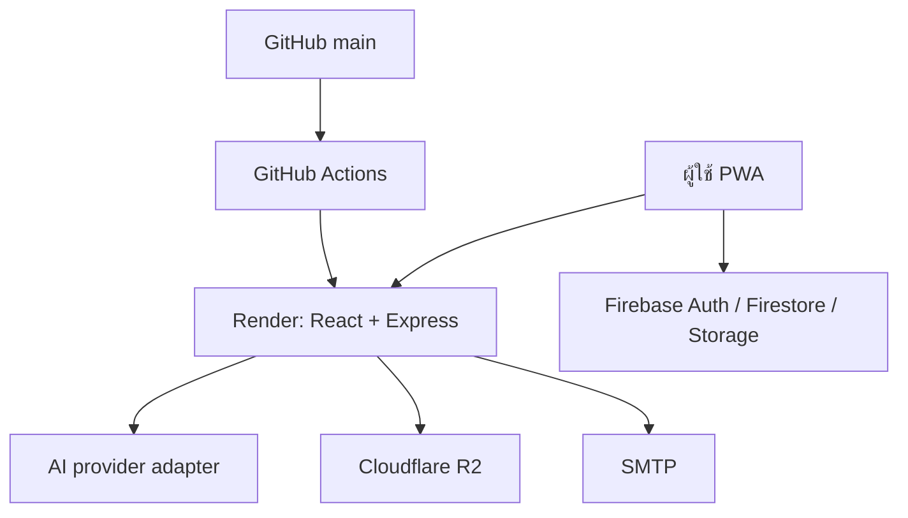

# สถาปัตยกรรม Nipponfarm หลังแยกจาก Google AI Studio

## คำตัดสิน

ให้ GitHub repository นี้เป็นแหล่งซอร์สหลัก และใช้โครงสร้างต่อไปนี้ในช่วงย้ายระบบ:

| ส่วน | สถานที่ใหม่ | เหตุผล |
| --- | --- | --- |
| Source control และ CI | GitHub | เป็นกลาง ตรวจสอบย้อนหลังได้ และไม่ผูกกับ IDE |
| Web + API + WebSocket | Render Web Service (Docker) | รัน Node/Express เดิมได้โดยไม่ต้องเขียนแอปใหม่ |
| Authentication + Database | Firebase project ที่ผู้ใช้เป็นเจ้าของ | ลดความเสี่ยงในการย้ายข้อมูลและไม่ต้องแก้ service layer ทั้งระบบทันที |
| รูปภาพ | Firebase Storage เป็นค่าเริ่มต้น; ImageKit เป็นตัวเลือก | โค้ดเดิมรองรับอยู่แล้ว |
| วิดีโอ | Cloudflare R2 | มีระบบ presigned URL เดิมและแยก credential ออกจากซอร์สแล้ว |
| AI | Adapter ฝั่ง server; เริ่มด้วย Gemini | Key ไม่เข้า browser และสามารถเพิ่ม provider ใหม่ใน adapter ได้ |
| Email | SMTP ผ่าน environment variables | เปลี่ยนผู้ให้บริการได้โดยไม่แก้โค้ด |

Firebase เป็นบริการแยกจาก AI Studio แม้อยู่ในระบบ Google Cloud การสร้าง Firebase project ใหม่ภายใต้บัญชีของผู้ใช้ทำให้ AI Studio ไม่ได้เป็นเจ้าของวงจรพัฒนา การ deploy หรือ secrets อีกต่อไป

## ภาพรวมการทำงาน

## ของเดิมที่ผูกกับ AI Studio และถูกถอดออกแล้ว

- Firebase config ไม่อ่านจาก `firebase-applet-config.json` อีกต่อไป
- ไม่มี Firebase API key ฝังอยู่ใน repository
- ไม่มี URL ของ AI Studio/Cloud Run เดิมเป็นค่า fallback
- ไม่มี `User-Agent: aistudio-build`
- Server ใช้ `PORT` จากระบบ hosting
- Secrets และ public runtime config กำหนดผ่าน environment variables
- มี Dockerfile และ Render Blueprint สำหรับ deploy จาก GitHub
- มี GitHub Actions ตรวจ TypeScript และ production build ทุกครั้งที่ push

## ข้อจำกัดที่ต้องรู้

- Render Free จะพักบริการเมื่อไม่มีการใช้งาน งาน `node-cron` เวลา 05:00 และ WebSocket จึงไม่เหมาะกับ production บน Free plan
- ช่วงทดลองใช้ Free plan ได้ แต่เมื่อใช้แจ้งเตือนประจำวันจริงต้องใช้ instance ที่ทำงานตลอดเวลา หรือแยก cron เป็น scheduled service
- การเปลี่ยน Firestore เป็น Supabase/Postgres ตอนนี้มีความเสี่ยงสูง เพราะ frontend เรียก Firestore โดยตรงหลายโมดูล ควรทำหลังระบบใหม่ออนไลน์และสำรองข้อมูลแล้ว
- Gemini ยังเป็น provider ที่ implement อยู่ในปัจจุบัน แต่การตั้งค่าอยู่ฝั่ง server และมีจุดรวม provider/model สำหรับเพิ่ม provider อื่นภายหลัง

## ขอบเขตความเป็นอิสระที่ได้

โค้ดสามารถ clone, build และ deploy จาก GitHub บนเครื่องหรือ hosting ที่รองรับ Docker ได้โดยไม่เปิด Google AI Studio การเปลี่ยน hosting ไม่กระทบฐานข้อมูล และการเปลี่ยน AI model ไม่ต้องย้ายแอปทั้งหมด
